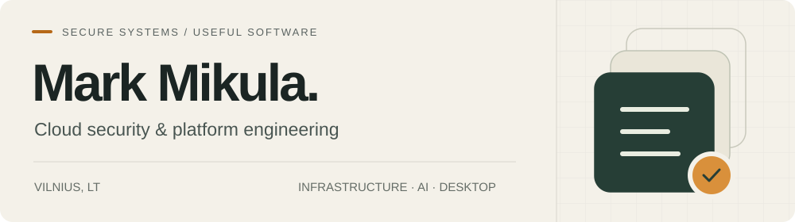
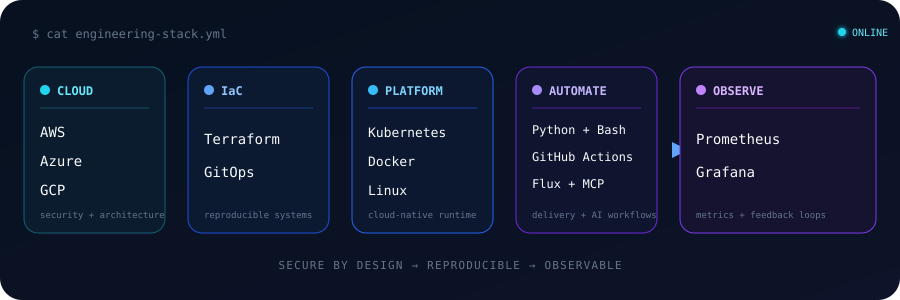

  

  
  

I build secure cloud platforms, AI-assisted products, and native system tools.
My work pairs infrastructure and security discipline with interfaces that solve
specific everyday problems.

## `> featured_builds`

| Project | What it does | Engineering focus |
| --- | --- | --- |
| **[AmberDetect](https://github.com/Humancannonball/amberdetect-oss)** · [live](https://amberdetect.com) | Turns public YouTube comments into a prioritized, explainable review queue for creators. | Next.js, TypeScript, external APIs, untrusted-input handling, privacy-first AI integration |
| **[LumaKnob](https://github.com/Humancannonball/LumaKnob)** · [releases](https://github.com/Humancannonball/LumaKnob/releases) | Extends Windows display brightness below the hardware floor with adjustable precision and an original equipment-style UI. | C# 14, .NET 10, Avalonia, Win32/WMI/DDC-CI, multi-monitor recovery, CI/release engineering |

Both projects are open source under permissive licenses and ship with automated
tests, security guidance, reproducible builds, and documented privacy boundaries.

## `> engineering_stack`

  

  

## `> security_credential`

  

  Tool icons provided by the open-source <a href="https://github.com/tandpfun/skill-icons">Skill Icons</a> project.

