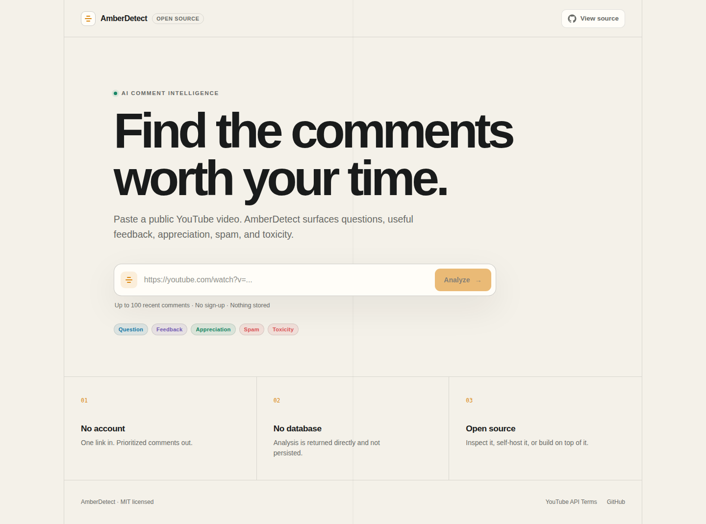

  

  <a href="https://amberdetect.com">Try AmberDetect ↗</a> &nbsp; · &nbsp;
  <a href="https://www.linkedin.com/in/mark2005/">LinkedIn</a> &nbsp; · &nbsp;
  <a href="https://github.com/Humancannonball?tab=repositories">Explore my code</a>

I’m **Mark**, a cloud security and platform engineer based in Vilnius. I automate infrastructure, build security tooling, and turn ideas into working software—from AI applications to Windows desktop tools.

### Selected work

#### AmberDetect · AI comment intelligence

Find the conversations worth your time in a YouTube comment section. Paste a video link to surface questions, feedback, appreciation, spam, and toxicity in a prioritized review queue.

**Next.js · TypeScript · YouTube Data API · DeepSeek**

Built as my machine-learning bachelor’s thesis project. The public edition keeps a small footprint: server-side API credentials, validated inputs, and temporary results without a database. AI classifications support human review.

**[Open the app ↗](https://amberdetect.com)** &nbsp; · &nbsp; [Read the source](https://github.com/Humancannonball/amberdetect-oss)

#### LumaKnob · Precision display control

A Windows app for per-monitor brightness, including software dimming below the hardware minimum. An instrument-inspired interface brings hardware controls and fine adjustment into one place.

**C# · .NET · Avalonia · Win32 · WMI · DDC/CI**

Engineering focus: native display integration, multi-monitor recovery, and a standalone desktop release.

**[Explore the project](https://github.com/Humancannonball/LumaKnob)** &nbsp; · &nbsp; [Windows alpha releases ↗](https://github.com/Humancannonball/LumaKnob/releases)

### What I work with

| Area | Tools & practice |
| :--- | :--- |
| Cloud security | AWS IAM, least privilege, Secrets Manager, Wiz / CSPM, architecture reviews |
| Infrastructure | AWS, Azure, Terraform, Kubernetes, Helm, Docker, Linux, Flux / GitOps |
| Automation | Python, Bash, SQL, GitHub Actions, GitLab CI/CD, credential lifecycle workflows |
| Observability & AI | Prometheus, Grafana, LLM APIs, MCP integrations |

My professional work includes cloud security onboarding automation, credential rotation, and architecture reviews across AWS, Azure, and GCP. **GIAC Security Essentials (GSEC)** certified.

---

Secure systems. Useful software. Code you can explore.

